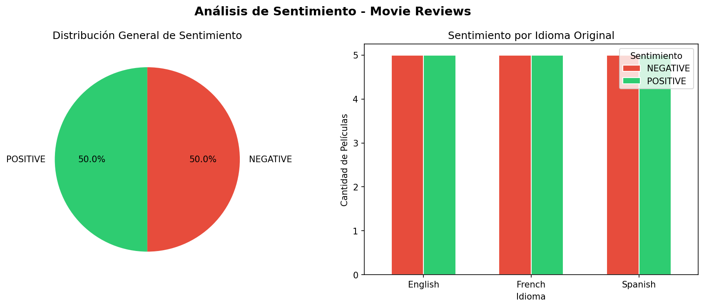

# 🎬 Multilingual NLP Pipeline: Translation & Sentiment Analysis

Proyecto desarrollado en el marco de la Maestría en Ciencia de Datos e IA Aplicada  
Universidad Católica Boliviana · Santa Cruz, Bolivia

---

## 📌 Descripción

Pipeline de NLP que procesa reseñas de películas en 3 idiomas (inglés, francés y español),
las unifica mediante traducción automática y aplica análisis de sentimiento
usando modelos pre-entrenados de HuggingFace Transformers.

---

## 🔧 Tecnologías utilizadas

- Python 3.12
- HuggingFace Transformers
- Helsinki-NLP (traducción automática)
- DistilBERT (análisis de sentimiento)
- Pandas
- SQLite
- Matplotlib
- Google Colab

---

## 🗂️ Datos de entrada

| Archivo | Idioma | Registros |
|---|---|---|
| movie_reviews_eng.csv | Inglés | 10 películas |
| movie_reviews_fr.csv | Francés | 10 películas |
| movie_reviews_sp.csv | Español | 10 películas |

---

## ⚙️ Pipeline del proyecto
3 CSV (EN + FR + ES)
↓
Unificación de columnas + etiqueta de idioma
↓
Traducción automática (Helsinki-NLP)
FR → EN: opus-mt-fr-en
ES → EN: opus-mt-es-en
↓
Análisis de sentimiento (DistilBERT SST-2)
↓
Export: CSV + SQLite + Gráficos

---

## 🤖 Modelos pre-entrenados

| Modelo | Propósito |
|---|---|
| `Helsinki-NLP/opus-mt-fr-en` | Traducción Francés → Inglés |
| `Helsinki-NLP/opus-mt-es-en` | Traducción Español → Inglés |
| `distilbert-base-uncased-finetuned-sst-2-english` | Análisis de sentimiento |

---

## 📊 Resultados

El modelo clasifica cada reseña como `POSITIVE` o `NEGATIVE` basándose
en el texto traducido al inglés.

---

## 🚀 Cómo ejecutar

1. Abrir `Proyecto2_TranslationSentiment_Transformers.ipynb` en Google Colab
2. Montar Google Drive
3. Colocar los 3 CSV en la carpeta `Proyecto2/` de tu Drive
4. Ejecutar las celdas en orden

---

## 👤 Autor

**Andres Poiche** · Maestría en Ciencia de Datos e IA Aplicada · UCB Santa Cruz  
[GitHub](https://github.com/andrespoiche)
